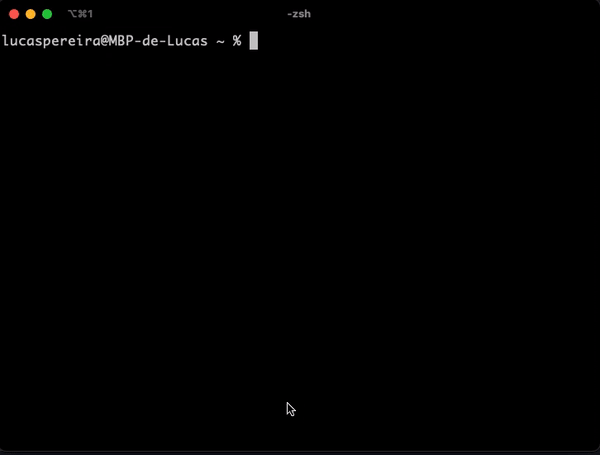

# For Windows💻 

<p>
    <a href="https://github.com/lucasnevespereira/go-gituser/releases/latest"></a>
    <a href="https://github.com/lucasnevespereira/go-gituser/actions/workflows/release.yml"></a> 
</p>

## Overview
[Lucas Neves Pereira](https://github.com/lucasnevespereira)さんが製作されているGitアカウントをCLI上でコマンド1つで複数管理できるツールです。

職場、学業、趣味開発用のアカウントを保持することが出来、現在どのアカウントを使っているかを確認することも可能です。

今回はどうしても僕がこのツールをWindowsで使いたかったので、コードをお借りしてExe形式で動くようにしました。




以下のコードが自動化されます。

```shell
git config --global user.name "yourUsername"
```

```shell
git config --global user.email "yourEmail"
```

#### 選択機能

以下の3つのアカウントを選択することが出来ます。

- 💻 <b>work</b> : 職場のGitアカウント
- 📚 <b>school</b> : 勉強用のGitアカウント
- 🏠 <b>personal</b> : 個人開発用のGitアカウント

## インストール方法

Windowsは標準でMakeコマンドが扱えないので、GnuWin32をインストールする必要があります。
[こちらの最上部のコンプリートプラン](https://gnuwin32.sourceforge.net/packages/make.htm)を導入してください。

また、環境変数に`C:\Hoge\GnuWin32\bin`といったようにパスを追加してください。
尚、インストールの際に空白文字列が入ったディレクトリに入れてしまうと正常にMakeコマンドが起動しなくなります。

次に以下のコマンドを実行してください。
```shell
make install
```

これらの導入を済ませれば、どのターミナルからでも `gituser` コマンドで呼び出しを行うことが出来ます 🐱

### アカウントの追加方法

以下のコマンドを実行してください。

```shell
gituser config
```

<em>コマンド実行後ターミナル上で設定すべき項目がナビゲートされます。指示に従って入力してください。 </em>

## 使用方法

`gituser`コマンドの後ろに何らかの指示を出して実行します。

```shell
gituser <mode>
```

<em>コマンドの例</em>

```shell
gituser work
```

```shell
gituser school
```

```shell
gituser personal
```

#### その他コマンド

`help` コマンドはどのようなコマンドがあるかを表示します。

`manual` コマンドはgituserがどういったツールなのかの説明を表示します。

`info` コマンドは各アカウントについての情報を表示します。

`now` コマンドは現在どのアカウントを使っているかを表示します。


## How to Contribute

If you want to contribute to this project please read the [Contribution Guide](CONTRIBUTING.md).

<hr>

## ライセンス表記

This project is under [MIT LICENSE](LICENSE)

Copyright (c) 2020 Lucas Neves Pereira

ライセンスはReadmeの下部に代表して記載させていただきます。
僕が書き換えた部分以外は全てオリジナルのライセンスに準拠します。